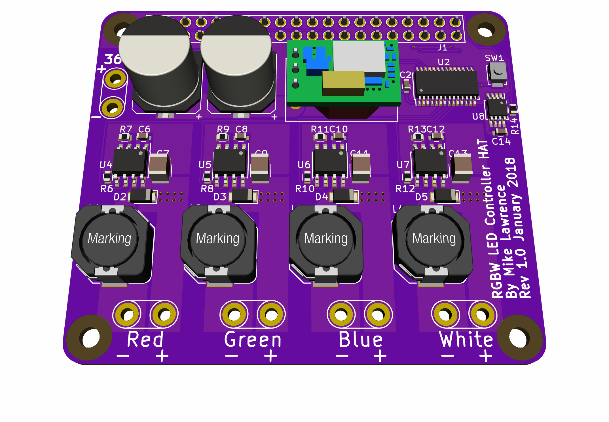
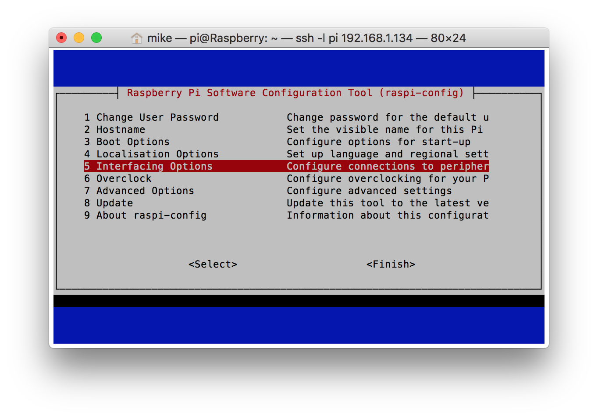
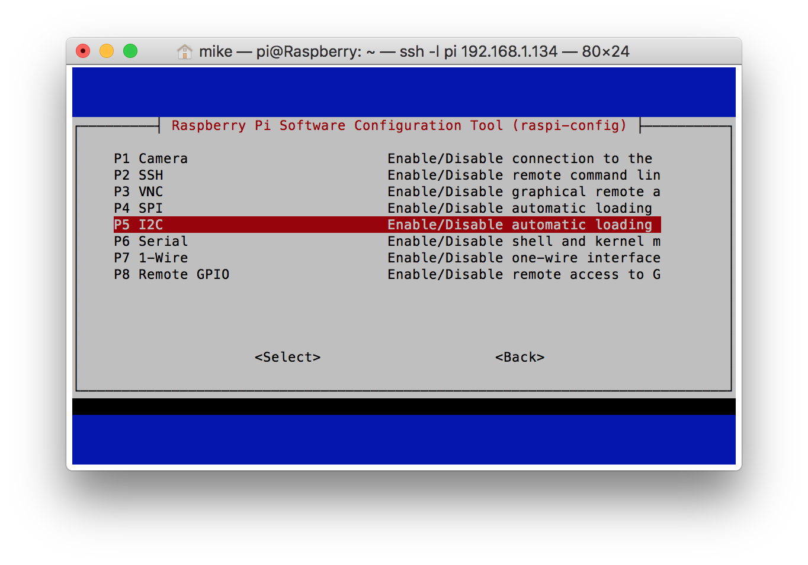
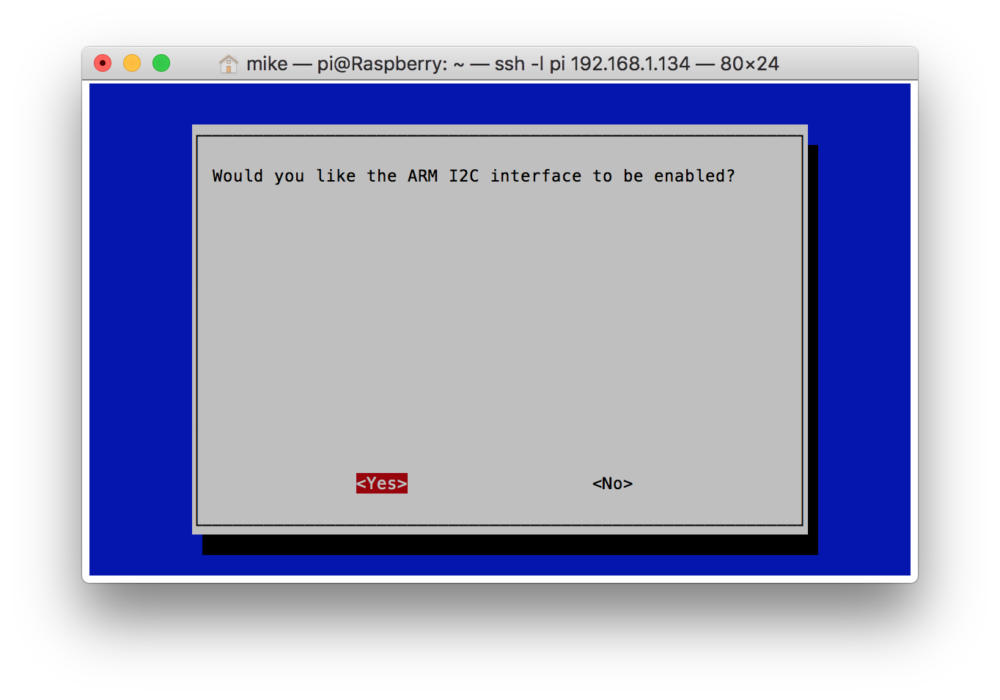

# Raspberry Pi RGBW LED Controller HAT
This is a [Raspberry Pi B+ HAT](https://github.com/raspberrypi/hats) that supports four high power LEDs. Each LED output uses a resistor configurable constant current driver with PWM support to control light intensity. A fourth LED channel was added to support color LEDs that have an extra Green or White LED. This HAT also supports Common-Anode LED configurations. The component selection as shown in the BOM is for a 50W RGB LED light that uses a constant current of 550mA at 24V-16.8V. The Design section discusses this in detail.

This PCB is designed using [KiCad](http://kicad-pcb.org). Note this design is using a nightly build of KiCad NOT the current released version (4.07). This HAT is based on [RPi_Hat_Template](https://github.com/xesscorp/RPi_Hat_Template) by XESS Corp.

_Note: The LM3414 parts have an exposed pad on the bottom which requires either a reflow oven or hot air to solder properly._

_Note: This HAT does not have the camera flex slot or the display flex cutout so technically cannot be called a HAT._

## Status
* Rev 1.0 PCB has been ordered, assembled, and tested.
  * Order the PCB from [OSH Park](https://oshpark.com/shared_projects/8nXTFx94).
  * Order the parts from Mouser using this [Shared BOM](https://www.mouser.com/ProjectManager/ProjectDetail.aspx?AccessID=8e67d22b4b).
  * The Green LED failed on one of my lights. The board is working as it should. This is most likely a LED module problem or incorrect output current. Replaced the module, changed the current from 550mA to 500mA and added a scale factor on the green output which currently limits the duty cycle to a maximum of 75%. Green output is higher in intensity anyways.


## Board Preview


## Design
### Input Power
Input power is 36VDC nominal with a range of 30V-37V. Input current is a maximum of 2A. This limit is due to the maximum current of the reverse input protection bridge rectifier (D1) which also serves to reduce the voltage on the 5V DC-DC converter (U3). If higher current is needed remove D1 and make the maximum input voltage 35VDC.

The Raspberry Pi can be safely back-powered by this HAT because the Ideal Diode circuit provides protection to both the Raspberry Pi and this HAT when the Raspberry Pi is powered by another source. Maximum Raspberry Pi power is 1.5A. Usually the Raspberry Pi will take substantially less than 1.5A when it is used with no external connections.

Example power budget...Powering a [50W RGB LED light](http://www.ebay.com/sch/sis.html?_nkw=Floodoor+LED+RGB+Flood+Light50W+Outdoor+Lights+Spot+Light+Lanscape+Lighting+w...&_id=253049210560&&_trksid=p2060353.m2749.l2658) purchased on eBay. The RGB LEDs of this light are wired with four wires in a common-anode configuration. For this light the White LED section is left unpopulated.

|                           | Current | Voltage | Power |
|---------------------------|---------|---------|-------|
| Red                       | 550mA   | 16.8V   | 9.24W |
| Green                     | 550mA   | 24V     | 13.2W |
| Blue                      | 550mA   | 24V     | 13.2W |
| LED Power                 |         |         | 35.6W |
| LED Power @ 80% Efficiency|         |         | 44.6W |
| Raspberry Pi              |         |         | 10.0W |
| Total System Power        |         |         | 54.6W |

A 60W 36VDC power supply will drive the Raspberry Pi, RGBW LED Controller HAT, and the High Power LEDs. [This](http://www.meanwellusa.com/webapp/product/search.aspx?prod=HLG-60H) power supply (part number HLG-60) from Mean Well will drive the 50W RGB light nicely.

### Power Reality Check
In my testing I placed a Raspberry Pi, RGBW LED Controller HAT, and a 60W Power Supply in an enclosure to check temperatures. When I ran a rainbow sweep test the power consumption was around 18W and the HAT had a temperature rise of about 20C - 25C over room temperature. A static purple color test (both read and blue at full power) with power consumption around 35W the HAT temperature rise was 30C - 35C. Clearly this HAT will need better cooling to run higher power LED configurations.

### LED driver
The LM3414 from TI is a 1-A, 60-W Common Anode-Capable Constant Current Buck LED Driver. Most constant current LED drivers have a current sense resistor in the high-side path which prevents common anode connections. The LM3414 puts the current sense resistor on the low side. This leaves the high side connected directly to the 36V of the input power. The positive side of all four LED outputs are connected together on the board forcing a common-anode topology. You must not connect the low side to ground.

The LM3414 average LED current (I<sub>L</sub>) is set by the R<sub>IADJ</sub> (R7, R9, R11, R13). Set LED average current to 550mA using the equation below.


Using the standard 1% resistor value the average LED current is


Choose a standard switching frequency (f<sub>SW</sub>) of 500kHz using equation below. Switching frequency (f<sub>SW</sub>) is set by R<sub>FS</sub> (R6, R8, R10, R12).


Using the standard 1% resistor value the switching frequency is


Determine minimum inductor value from maximum peak-to-peak LED current ripple (ΔI<sub>LPP</sub>) using equation below. Set ΔI<sub>LPP</sub> to 200mA.


Using the standard inductor value the peak-to-peak LED current ripple is


Determine peak LED current (I<sub>LP</sub>) using selected components using equation below. I<sub>LP</sub> is also the peak current through the inductor.


Compute the operating duty cycle (D) using equation below.


Determine minimum C<sub>IN</sub> (C7, C9, C11, C13) for 200mV or less voltage ripple (ΔV<sub>IN</sub>) using equation below.


### PWM Controller
A Raspberry Pi has only one hardware capable PWM pin (GPIO18). With up to four PWM outputs needed for this HAT I decided to use a PCA9685 from NXP alleviate the load on the Raspberry Pi. The PCA9685 from NXP is a 16-Channel, 12-bit, I<sup>2</sup>C PWM controller. It supports independent LED on and off times so the LED outputs can be adjusted in phase along with pulse width. However, when phase is changed from 0 the next PWM cycle will reset the output. For frequent updates this causes the the output light to flicker.

There are few settings that are important to using the PCA9685 on this HAT. First the EXTCLK bit in the MODE1 register must be set to 0. In the MODE2 register the INVRT bit must be set to 0 and the OUTDRV bit must be set to 1. Luckily this is the default state for all of these bits.

## Raspberry Pi Setup
This setup makes two key assumptions. First you are using Raspbian. Second, Python3 is the target programming environment. Install or update Python3 and necessary libraries by performing the following...
```
sudo apt-get update
sudo apt-get -y install build-essential python3-dev python3-pip git i2c-tools python3-smbus python3-w1thermsensor
pip3 install Adafruit-GPIO
```

### Configure ID EEPROM
Raspberry Pi HATs require an ID EEPROM with data that uniquely identifies every hat ever made. Start by cloning this repository on your Raspberry Pi, building the EEPROM tools, and make the the `eeprom_settings.eep` file.
```
mkdir ~/projects
cd ~/projects
git clone https://github.com/mikelawrence/RPi-HAT-RGBW-LED-Controller
cd RPi-HAT-RGBW-LED-Controller/eeprom/
make all
./eepmake eeprom_settings.txt eeprom_settings.eep
```
The next command writes the freshly generated and unique `eeprom_settings.eep` file to the EEPROM but you must push and hold the write switch on the HAT before executing this command. By default the EEPROM on the HAT is write protected. Pushing the write switch allows writes to occur.
```
sudo ./eepflash.sh -w -f=eeprom_settings.eep -t=24c32
```
You will see the following if writing to the EEPROM was successful.
```
This will attempt to talk to an eeprom at i2c address 0x50. Make sure there is an eeprom at this address.
This script comes with ABSOLUTELY no warranty. Continue only if you know what you are doing.
Do you wish to continue? (yes/no): yes
Writing...
0+1 records in
0+1 records out
117 bytes (117 B) copied, 2.31931 s, 0.1 kB/s
Done.
```
This is what you will see if there is a problem communicating with the EEPROM.
```
This will attempt to talk to an eeprom at i2c address 0x50. Make sure there is an eeprom at this address.
This script comes with ABSOLUTELY no warranty. Continue only if you know what you are doing.
Do you wish to continue? (yes/no): yes
Writing...
dd: error writing ‘/sys/class/i2c-adapter/i2c-3/3-0050/eeprom’: Connection timed out
0+1 records in
0+0 records out
0 bytes (0 B) copied, 0.0539977 s, 0.0 kB/s
Error doing I/O operation.
```

### Setup Interfaces
For this HAT you will need to enable the I<sup>2</sup>C and 1-Wire interfaces. From the command line type `sudo raspi-config ` and follow the prompts to install I<sup>2</sup>C support in the kernel.



Now follow the same actions but enabling the 1-Wire interface.

It's time to reboot your Raspberry Pi with `sudo reboot`.

### Test PCA9685 12-bit PWM Controller
Now let's see if the PWM Controller is present on the I<sup>2</sup>C bus by running `sudo i2cdetect -y 1`. Looking at the output of the `i2cdetect` command you will see `40` and `70` in a field of `--` when the PCA9685 is detected on the bus. If you don't see the `40` something is wrong with the HAT or the bus is disabled. `i2cdetect` was installed when you installed the i2c-tools package in the Raspberry Pi Setup section.
```
pi@rpi-rgb-led-1:~ $ sudo i2cdetect -y 1
     0  1  2  3  4  5  6  7  8  9  a  b  c  d  e  f
00:          -- -- -- -- -- -- -- -- -- -- -- -- --
10: -- -- -- -- -- -- -- -- -- -- -- -- -- -- -- --
20: -- -- -- -- -- -- -- -- -- -- -- -- -- -- -- --
30: -- -- -- -- -- -- -- -- -- -- -- -- -- -- -- --
40: 40 -- -- -- -- -- -- -- -- -- -- -- -- -- -- --
50: -- -- -- -- -- -- -- -- -- -- -- -- -- -- -- --
60: -- -- -- -- -- -- -- -- -- -- -- -- -- -- -- --
70: 70 -- -- -- -- -- -- --                         
```

### Test the DS18B20 1-Wire Thermometer
[Python3-w1thermsensor](https://github.com/timofurrer/w1thermsensor) is a nice 1-Wire python library that also supports command line reading of temperatures from 1-Wire devices. You should have already installed this package in the [Raspberry Pi Setup](#Raspberry-Pi-Setup) section.

Now test the RGBW LED Controller HAT's DS18B20 temperature sensor using `w1thermsensor all`.
```
pi@rpi-rgb-led-1:~ $ w1thermsensor all
Got temperatures of 1 sensors:
  Sensor 1 (00000991f822) measured temperature: 25.69 celsius
```
# RGBW LED Controller HAT Test
See code-test section [README.md](code-test/README.md) for code that fires up the RGBW LED Controller HAT by blending between the primary colors and monitoring temperatures.
